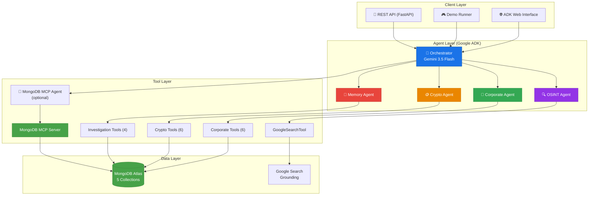
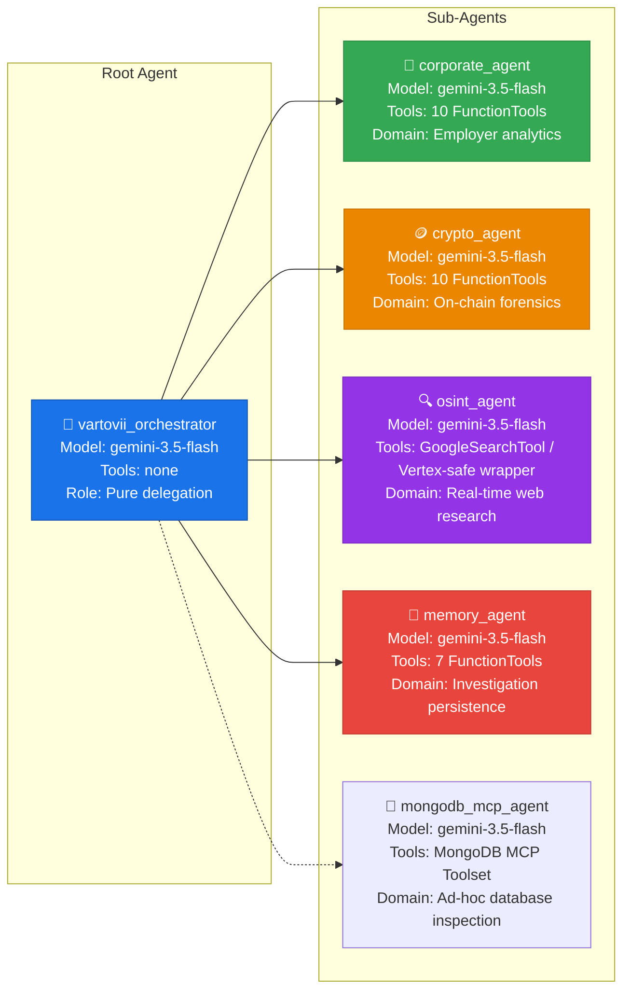
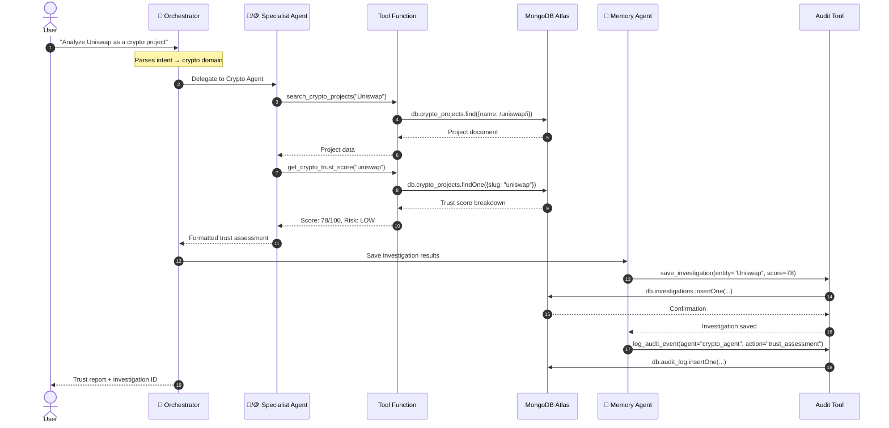
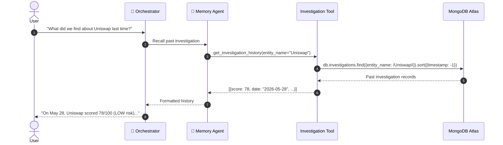
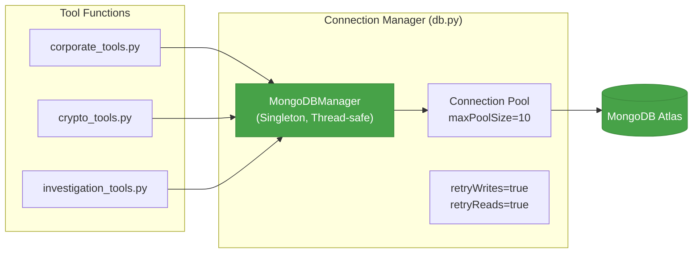
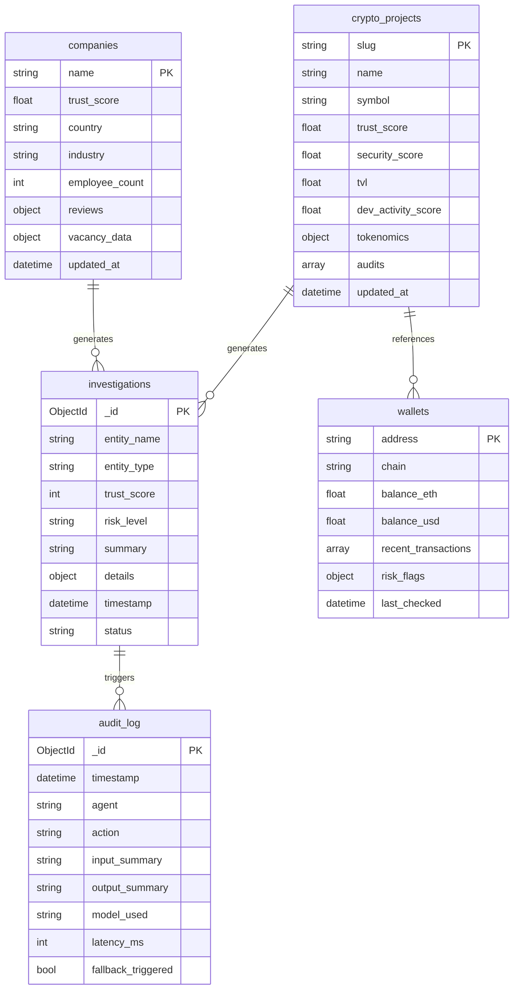
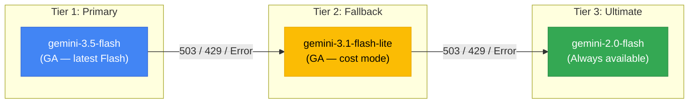
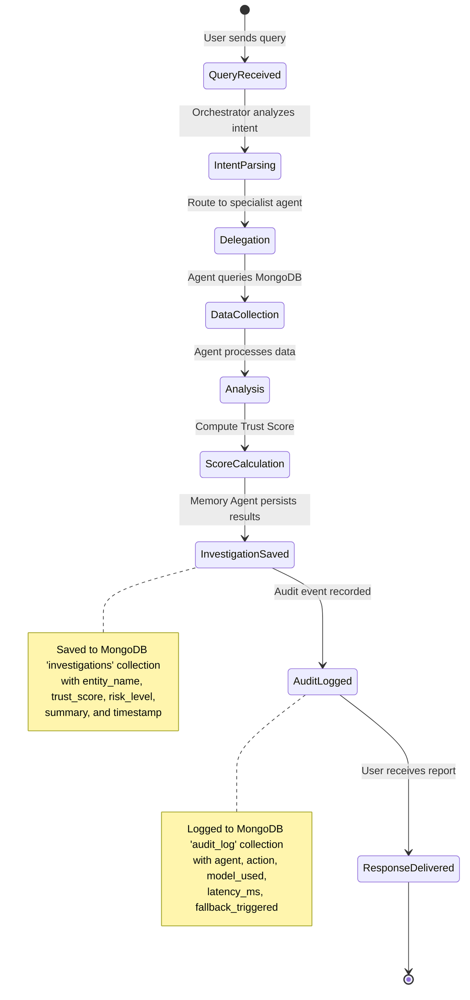
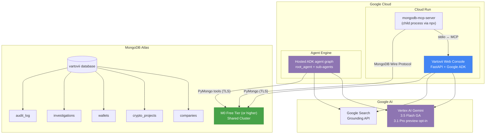
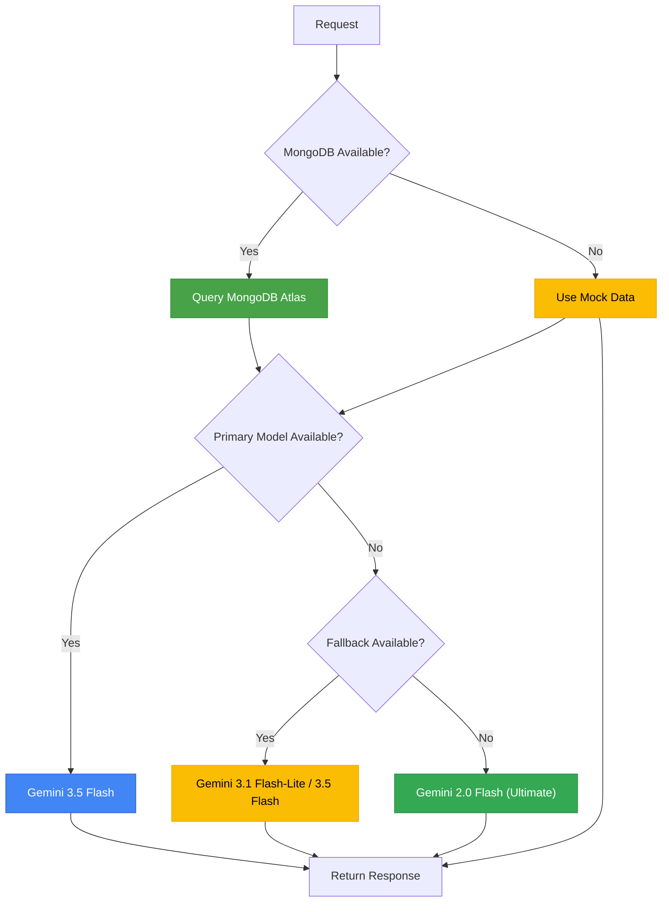

# 🛡️ Vartovii Trust Intelligence Agent — Architecture

> Technical architecture document for the **Vartovii Trust Intelligence Agent**, an autonomous multi-agent system for fraud detection and trust verification — built with Google ADK, Vertex AI Gemini, and MongoDB Atlas via MCP.
>
> **Track:** MongoDB · **Google Cloud Rapid Agent Hackathon**

---

## Table of Contents

1. [System Overview](#1-system-overview)
2. [Agent Topology](#2-agent-topology)
3. [Communication Flow](#3-communication-flow)
4. [MongoDB MCP Integration](#4-mongodb-mcp-integration)
5. [Data Model](#5-data-model)
6. [3-Tier Model Fallback](#6-3-tier-model-fallback)
7. [Tool Catalog](#7-tool-catalog)
8. [Investigation & Audit Flow](#8-investigation--audit-flow)
9. [Deployment Architecture](#9-deployment-architecture)
10. [Security & Resilience](#10-security--resilience)

---

## 1. System Overview

Vartovii is a **multi-agent trust intelligence system** that transforms fragmented public signals into decision-grade assessments. The system is built on Google's Agent Development Kit (ADK) and uses MongoDB Atlas as the primary data layer, accessed through both custom PyMongo tools and the official MongoDB MCP Server.



### Design Principles

| Principle | Implementation |
|-----------|---------------|
| **Decoupled Domains** | Each agent is an independent `LlmAgent` with its own tools, context boundary, and system prompt |
| **Deterministic Orchestration** | Orchestrator acts purely as a router — it is explicitly barred from answering queries directly |
| **Data Persistence** | All investigations and audit events are stored in MongoDB Atlas for cross-session memory |
| **Resilient Execution** | 3-tier model fallback + graceful degradation to mock data when MongoDB is unavailable |
| **Compliance by Design** | Full audit trail of every agent action — who, what, when, which model, latency |

---

## 2. Agent Topology

The system deploys **5 specialized agents** defined in [`agent/adk_agent.py`](agent/adk_agent.py):



### 2.1 Root Orchestrator (`vartovii_orchestrator`)

| Property | Value |
|----------|-------|
| **Role** | Traffic director and context manager |
| **Model** | `gemini-3.5-flash` (production GA) / `gemini-3.1-pro-preview` for explicit report opt-in |
| **Tools** | None — raw MongoDB MCP access is delegated to `mongodb_mcp_agent` when configured |
| **Behavior** | Analyzes user intent, evaluates conversation history, delegates to exactly one sub-agent. **Never answers directly.** |

The orchestrator's system prompt explicitly forbids direct answers:

> *"You are the top-level orchestrator. Your ONLY job is to understand the user query and delegate it to the correct sub-agent. NEVER answer questions yourself."*

### 2.2 Corporate Agent (`corporate_agent`)

| Property | Value |
|----------|-------|
| **Role** | Employer analytics — Trust Score, reviews, comparisons, vacancy intelligence |
| **Model** | `gemini-3.5-flash` |
| **Tools** | 10 `FunctionTool`s → MongoDB `companies` collection |
| **Data Sources** | Glassdoor, Kununu, Google Reviews, GitHub (aggregated in MongoDB) |

### 2.3 Crypto Agent (`crypto_agent`)

| Property | Value |
|----------|-------|
| **Role** | Blockchain forensics, smart contract analysis, token distribution audits |
| **Model** | `gemini-3.5-flash` |
| **Tools** | 10 `FunctionTool`s → MongoDB `crypto_projects`, `wallets` collections |
| **Data Sources** | CoinGecko, Etherscan, DeFiLlama, GitHub (aggregated in MongoDB) |

### 2.4 OSINT Agent (`osint_agent`)

| Property | Value |
|----------|-------|
| **Role** | Real-time web research for entities not in database |
| **Model** | `gemini-3.5-flash` |
| **Tools** | `GoogleSearchTool` (Google Search Grounding) |
| **Use Cases** | Founder background checks, recent news, domain verification, emerging projects |

### 2.5 Memory Agent (`memory_agent`)

| Property | Value |
|----------|-------|
| **Role** | Investigation persistence and audit trail management |
| **Model** | `gemini-3.5-flash` |
| **Tools** | 7 `FunctionTool`s → MongoDB `investigations`, `audit_log` collections |
| **Capabilities** | Save investigation results, recall past analyses, log audit events, query audit trail |

---

## 3. Communication Flow

### Standard Investigation Flow



### Cross-Session Recall Flow



---

## 4. MongoDB MCP Integration

Vartovii connects to MongoDB Atlas through **two complementary pathways**, maximizing both structured reliability and dynamic flexibility.

### 4.1 Custom PyMongo Tools (Structured Access)

Each domain agent uses purpose-built `FunctionTool`s backed by a **singleton MongoDB connection manager**:



**Key features:**
- Thread-safe singleton with double-checked locking
- Connection pooling (`maxPoolSize=10`)
- Health checks via `admin.command("ping")`
- Automatic retry (`retryWrites`, `retryReads`)
- 5-second connection timeout
- Graceful fallback to mock data when MongoDB is unavailable

### 4.2 MongoDB MCP Server (Dynamic Access)

The official [`mongodb-mcp-server`](https://github.com/mongodb-js/mongodb-mcp-server) runs as a child process, exposing MongoDB operations via the [Model Context Protocol](https://modelcontextprotocol.io):

```python
# agent/adk_agent.py — MCP initialization
from google.adk.tools.mcp_tool.mcp_toolset import McpToolset, StdioConnectionParams

toolset = McpToolset(
    connection_params=StdioConnectionParams(
        command="npx",
        args=["-y", "mongodb-mcp-server"],
        env={
            "MONGODB_CONNECTION_STRING": conn_string,
            "PATH": os.environ.get("PATH", ""),
        },
    ),
)
```

**MCP-exposed operations:**

| Operation | Description |
|-----------|-------------|
| `find` | Query documents with filters and projections |
| `aggregate` | Run aggregation pipelines |
| `insertOne` | Insert a single document |
| `updateOne` | Update a single document |
| `deleteOne` | Delete a single document |
| `listDatabases` | List all databases |
| `listCollections` | List collections in a database |
| `createIndex` | Create an index on a collection |
| `explain` | Get query execution plans |

### 4.3 Why Both?

| Aspect | Custom PyMongo Tools | MongoDB MCP Server |
|--------|---------------------|-------------------|
| **Access Pattern** | Structured, pre-defined queries | Dynamic, ad-hoc queries |
| **Type Safety** | Full Python type hints | Schema-less |
| **Performance** | Direct connection pooling | Subprocess + stdio |
| **Use Case** | Known query patterns (Trust Score, search) | Exploratory queries, aggregations |
| **Availability** | Always (with fallback to mock) | Requires `npx` + npm |

This dual approach gives agents **both reliability and flexibility** — structured tools handle the 90% case, while the optional MCP specialist handles edge cases where the system needs custom queries, aggregations, or explain plans.

---

## 5. Data Model

### 5.1 MongoDB Collections



### 5.2 Collection Details

#### `companies`
Stores corporate entity profiles aggregated from multiple sources (Glassdoor, Kununu, Google Reviews). Each document contains a multi-dimensional trust score breakdown across 6 pillars: employee satisfaction, financial stability, management quality, growth trajectory, work-life balance, and transparency.

#### `crypto_projects`
Contains cryptocurrency project profiles with trust scores derived from security audits, developer activity (GitHub commits), Total Value Locked (TVL), tokenomics analysis, and holder concentration metrics.

#### `wallets`
Blockchain wallet records with balance snapshots, recent transaction history, and risk flags (e.g., interaction with known mixer contracts, sanctions-list addresses).

#### `investigations`
Persisted results of completed trust assessments. Enables cross-session memory — agents can recall what they found about an entity in previous conversations.

#### `audit_log`
Immutable record of every significant agent action. Each entry captures: which agent acted, what action was performed, which model was used, response latency, and whether a model fallback was triggered.

---

## 6. 3-Tier Model Fallback

The fallback system ensures **zero user-visible failures** by cascading through progressively more stable models:



### Model Profiles

Controlled via `GEMINI_MODEL_PROFILE` environment variable:

| Profile | Agent | Chat | Report | Fallback Chain |
|---------|-------|------|--------|---------------|
| **stable** | `gemini-3.5-flash` | `gemini-3.5-flash` | `gemini-3.5-flash` | → `gemini-2.0-flash` |
| **cost** | `gemini-3.1-flash-lite` | `gemini-3.1-flash-lite` | `gemini-3.1-flash-lite` | → `gemini-3.5-flash` → `gemini-2.0-flash` |
| **preview** | `gemini-3.5-flash` | `gemini-3.5-flash` | `gemini-3.1-pro-preview` | → `gemini-3.5-flash` → `gemini-2.0-flash` |

### Fallback Logic (`config.py`)

```python
@classmethod
def get_model_chain_for_task(cls, task: str) -> list[str]:
    """Return primary→fallback→ultimate chain for resilient generation."""
    primary = cls.get_model_for_task(task)
    fallback = cls.get_fallback_model_for_task(task)
    chain = [primary]
    if cls.MODEL_FALLBACK_ENABLED and fallback and fallback != primary:
        chain.append(fallback)
    ultimate_fallback = "gemini-2.0-flash"
    if cls.MODEL_FALLBACK_ENABLED and ultimate_fallback not in chain:
        chain.append(ultimate_fallback)
    return chain
```

### Transient Error Retry

Before triggering a model fallback, the system retries transient errors with exponential backoff:

| Attempt | Delay | Retried Errors |
|---------|-------|---------------|
| 1 | Immediate | — |
| 2 | 0.75s | HTTP 503, HTTP 429, `RESOURCE_EXHAUSTED` |
| 3 | 1.5s | HTTP 503, HTTP 429, `RESOURCE_EXHAUSTED` |
| Fallback | — | All other errors → next model in chain |

---

## 7. Tool Catalog

### 28 Custom Tools Across 4 Core Specialist Agents

#### 🏢 Corporate Agent — 10 Tools

| Tool | Function | MongoDB Collection | Description |
|------|----------|-------------------|-------------|
| `search_company` | `search_company(query)` | `companies` | Full-text search for company records |
| `get_trust_score` | `get_trust_score(company)` | `companies` | Retrieve 6-pillar trust breakdown |
| `list_companies` | `list_companies(sort_by, limit)` | `companies` | Sorted company listings |
| `compare_companies` | `compare_companies(names)` | `companies` | Side-by-side comparison matrix |
| `get_company_reviews` | `get_company_reviews(company)` | `companies` | Employee review sentiment analysis |
| `get_vacancy_intelligence` | `get_vacancy_intelligence(company)` | `companies` | Ghost job detection, hiring health |
| `find_similar_companies` | `find_similar_companies(company)` | `companies` | Similar risk profile discovery |
| `get_salary_insights` | `get_salary_insights(company)` | `companies` | Compensation and salary intelligence |
| `get_hiring_trends` | `get_hiring_trends(company)` | `companies` | Hiring velocity and demand trend analysis |
| `get_industry_benchmark` | `get_industry_benchmark(industry)` | `companies` | Industry-level trust score benchmarking |

#### 🪙 Crypto Agent — 10 Tools

| Tool | Function | MongoDB Collection | Description |
|------|----------|-------------------|-------------|
| `search_crypto_projects` | `search_crypto_projects(query)` | `crypto_projects` | Search crypto project database |
| `get_crypto_trust_score` | `get_crypto_trust_score(project)` | `crypto_projects` | Security score, TVL, dev activity |
| `check_wallet` | `check_wallet(address)` | `wallets` | ETH balance, USD value, risk flags |
| `get_transaction_history` | `get_transaction_history(address)` | `wallets` | Recent normalized transactions |
| `get_token_holders` | `get_token_holders(project)` | `crypto_projects` | Token concentration risk analysis |
| `get_contract_info` | `get_contract_info(address)` | `crypto_projects` | Smart contract verification, bytecode |
| `find_similar_crypto` | `find_similar_crypto(project)` | `crypto_projects` | Similar crypto risk profile discovery |
| `get_liquidity_analysis` | `get_liquidity_analysis(project)` | `crypto_projects` | Liquidity depth, pool, and market health analysis |
| `get_whale_tracking` | `get_whale_tracking(project)` | `crypto_projects` | Whale wallet movement and concentration monitoring |
| `get_defi_metrics` | `get_defi_metrics(project)` | `crypto_projects` | DeFi TVL, protocol, and market structure metrics |

#### 🔍 OSINT Agent — 1 Tool

| Tool | Type | Description |
|------|------|-------------|
| `GoogleSearchTool` | Native ADK Tool | Google Search Grounding — real-time web queries |

#### 🧠 Memory Agent — 7 Tools

| Tool | Function | MongoDB Collection | Description |
|------|----------|-------------------|-------------|
| `save_investigation` | `save_investigation(entity, score, ...)` | `investigations` | Persist completed investigation |
| `get_investigation_history` | `get_investigation_history(entity)` | `investigations` | Recall past investigations |
| `log_audit_event` | `log_audit_event(agent, action, ...)` | `audit_log` | Log action for compliance |
| `get_audit_trail` | `get_audit_trail(limit, agent)` | `audit_log` | Query audit history |
| `cross_entity_risk_scan` | `cross_entity_risk_scan(...)` | `companies`, `crypto_projects` | Find high-risk entities across domains |
| `get_entity_network` | `get_entity_network(entity)` | multiple | Build related-entity and risk relationship views |
| `generate_risk_report` | `generate_risk_report(entity)` | multiple | Produce structured cross-signal risk reports |

#### 🔌 MongoDB MCP Server — Dynamic Tools

When configured, the MCP server exposes additional MongoDB operations (`find`, `aggregate`, `insertOne`, `updateOne`, `deleteOne`, `listDatabases`, `listCollections`, `createIndex`, `explain`) to the optional `mongodb_mcp_agent`, which the orchestrator can delegate to for ad-hoc database work.

---

## 8. Investigation & Audit Flow

Every trust assessment follows a consistent lifecycle:



### Audit Event Schema

```json
{
  "timestamp": "2026-05-29T20:15:00Z",
  "agent": "crypto_agent",
  "action": "get_crypto_trust_score",
  "input_summary": "Trust assessment for Uniswap",
  "output_summary": "Score: 78/100, Risk: LOW",
  "model_used": "gemini-3.5-flash",
  "latency_ms": 1247,
  "fallback_triggered": false
}
```

### Investigation Document Schema

```json
{
  "entity_name": "Uniswap",
  "entity_type": "crypto",
  "trust_score": 78,
  "risk_level": "LOW",
  "summary": "Strong DeFi protocol with high TVL, active development, and audited contracts.",
  "details": {
    "security_score": 85,
    "dev_activity_score": 92,
    "tvl": 5200000000
  },
  "timestamp": "2026-05-29T20:15:00Z",
  "status": "completed"
}
```

---

## 9. Deployment Architecture



Cloud Run is the primary hosted product surface because the container includes
the FastAPI dashboard, static web console, and Node.js runtime required for the
official MongoDB MCP server. Agent Engine is the hosted Google Cloud agent
runtime path for the ADK graph and can be deployed with
`scripts/deploy_agent_engine.sh`.

The Agent Engine helper generates a temporary sanitized env file by default. It
keeps `MONGODB_MCP_ENABLED=false` and `MONGODB_ENABLED=false` so the hosted ADK
graph can be deployed without copying local secrets or trying to launch the
Cloud Run container's Node.js MCP child process. Cloud Run remains the live
MongoDB + MCP product surface.

### Environment Variables

| Variable | Required | Description |
|----------|----------|-------------|
| `GOOGLE_API_KEY` | ✅ | Google AI Studio API key |
| `MONGODB_CONNECTION_STRING` | ✅ | MongoDB Atlas connection URI |
| `MONGODB_DATABASE` | — | Database name (default: `vartovii`) |
| `MONGODB_ENABLED` | — | Enable/disable MongoDB (default: `true`) |
| `MONGODB_MCP_ENABLED` | — | Enable/disable Node-based MongoDB MCP child process (default: `true`) |
| `AGENT_ENGINE_MCP_ENABLED` | — | Enable/disable MCP for Agent Engine deploys (default: `false`) |
| `GEMINI_MODEL_PROFILE` | — | `stable` (Gemini 3.5 Flash GA), `cost` (Gemini 3.1 Flash-Lite GA), or `preview` (Gemini 3.1 Pro report opt-in) |
| `ADK_ENABLED` | — | Enable/disable ADK agents (default: `true`) |
| `GOOGLE_CLOUD_PROJECT` | — | GCP project ID (for Cloud Run and Agent Engine) |
| `GOOGLE_CLOUD_LOCATION` | — | Vertex AI Gemini location (default: `global`) |
| `CLOUD_RUN_REGION` | — | Cloud Run deployment region (default: `europe-west1`) |
| `AGENT_ENGINE_REGION` | — | Agent Engine deployment region (default: `europe-west1`) |

---

## 10. Security & Resilience

### Connection Security

- **MongoDB Atlas**: TLS-encrypted connections via `mongodb+srv://` URI scheme
- **Gemini API**: HTTPS with API key authentication
- **MCP Server**: Local stdio transport (no network exposure)
- **Secrets**: Environment variables only — never hardcoded, never committed

### Graceful Degradation

The system has **3 layers of fallback**:



1. **Data Layer**: MongoDB unavailable → fallback to mock data (zero-downtime demo experience)
2. **Model Layer**: Primary model error → cascade through 3-tier fallback chain
3. **Agent Layer**: ADK failure → fallback to legacy tool execution

### Monitoring

- **SLA Tracking**: Every request checked against 15.0s threshold
- **Fallback Metrics**: Transitions between models are logged and tracked
- **Session Analytics**: Session reuse ratio for conversation state efficiency
- **Latency Percentiles**: Cross-route latency profiling

---

<p align="center">
  <strong>🏆 Built for Google Cloud Rapid Agent Hackathon — MongoDB Track</strong><br/>
  <em>5 core agents · 28 custom tools · optional MongoDB MCP specialist · Vertex AI Gemini · Google ADK</em>
</p>
