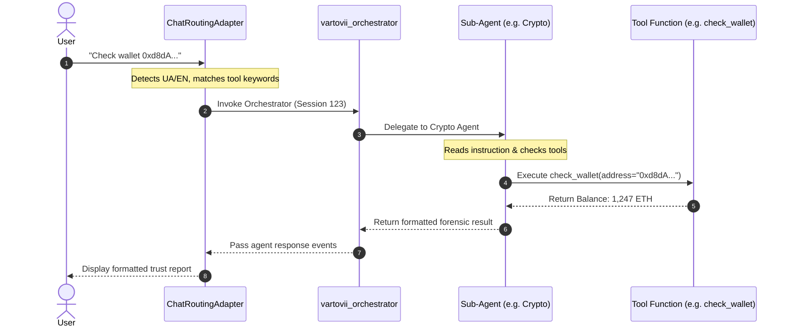

# 🛡️ Vartovii Multi-Agent Trust Engine Architecture

This document describes the technical architecture, design principles, and optimization strategies of the **Vartovii Trust Intelligence Agent** — powered by Google's **Agent Development Kit (ADK)** and the **Gemini** model family.

---

## 🏗️ Architectural Overview

Vartovii is a B2B SaaS trust intelligence platform. The core agent system is designed to orchestrate specialized analytical tasks across corporate reputation, on-chain crypto forensics, and real-time open-source intelligence (OSINT).

```
                      +-----------------------------+
                      |         User Query          |
                      +--------------+--------------+
                                     |
                                     v
                      +--------------+--------------+
                      |    Chat Routing Adapter     |
                      +--------------+--------------+
                                     |
             +-----------------------+-----------------------+
             | (Tool Calling Query)                          | (General/Simple Query)
             v                                               v
+------------+------------+                     +------------+------------+
|  ADK Orchestrator Agent |                     |   Standard Chat Pipeline|
|  (vartovii_orchestrator)|                     |   (gemini-2.5-flash)     |
+------------+------------+                     +-------------------------+
             |
             +-----------------------+-----------------------+
             |                       |                       |
             v                       v                       v
+------------+------------+ +--------+---------+    +--------+---------+
|     Corporate Agent     | |    Crypto Agent   |    |    OSINT Agent   |
|   (employer analytics)  | |(on-chain forensics)|   |  (web search)    |
+------------+------------+ +--------+---------+    +--------+---------+
             |                       |                       |
     [6 Corporate Tools]       [6 Crypto Tools]      [Google Search Tool]
```

---

## 🧬 Design Principles

1. **Decoupled Execution Domains:** Each sub-agent functions as an independent `LlmAgent` instance with distinct context boundaries, model configs, and tools.
2. **Deterministic Orchestration:** The root orchestrator (`vartovii_orchestrator`) acts purely as a routing/delegation node. It is barred from answering queries directly, minimizing hallucination and ensuring requests land in the correct domain.
3. **Resilient Fallbacks:** A 3-tier fallback chain (Task model -> Flash model -> 2.0 Flash) prevents user-facing service outages.
4. **Session Persistence:** State is preserved across multiple turns using conversation-to-session mappings via ADK's `InMemoryRunner`.
5. **Graceful Degradation:** If the ADK runtime experiences catastrophic failure, the router falls back to legacy tool adapters immediately.

---

## 🤖 Agent Topology

The system deploys 4 specialized agents defined in [agent/adk_agent.py](file:///Users/vitaliiradionov/Code/vartovii-trust-agent/agent/adk_agent.py):

### 1. Root Orchestrator (`vartovii_orchestrator`)
* **Role:** Traffic director and context manager.
* **Model:** `gemini-2.5-flash` (Stable profile)
* **Goal:** Understand user query intent, evaluate conversation history, and delegate to exactly one sub-agent.
* **Tools:** None (delegates only).

### 2. Corporate Agent (`corporate_agent`)
* **Role:** Analyzes companies as employers, including ratings, vacancy health, and employee reviews.
* **Model:** `gemini-2.5-flash` (Stable profile)
* **Tools:**
  * `search_company`: Queries company records.
  * `get_trust_score`: Retrieves employer trust breakdown.
  * `list_companies`: Returns sorted lists of corporate records.
  * `compare_companies`: Generates side-by-side comparison matrix.
  * `get_company_reviews`: Retrieves employee feedback sentiment.
  * `get_vacancy_intelligence`: Analyzes job listings for ghost job risks.

### 3. Crypto Agent (`crypto_agent`)
* **Role:** Blockchain forensics, smart contract analysis, and token distribution audits.
* **Model:** `gemini-2.5-flash` (Stable profile)
* **Tools:**
  * `search_crypto_projects`: Queries crypto database records.
  * `get_crypto_trust_score`: Retrieves security scores, TVL, and dev activity.
  * `check_wallet`: Retrieves ETH balances and USD values.
  * `get_transaction_history`: Normalizes recent transactions.
  * `get_token_holders`: Evaluates token concentration risk.
  * `get_contract_info`: Analyzes bytecode verification and contract metadata.

### 4. OSINT Agent (`osint_agent`)
* **Role:** Performs real-time search queries to ground the conversation in current facts when database queries return empty.
* **Model:** `gemini-2.5-flash` (Stable profile)
* **Tools:**
  * `GoogleSearchTool` (Native Google Search Grounding).

---

## 🔄 Interaction Flow



---

## 🛡️ Resilience Engine

The resilience engine operates across three distinct layers:

### 1. Three-Tier Model Fallback
Models are resolved dynamically according to the active configuration profile:

```
[Primary Task Model] ===(on error)===> [Task Fallback] ===(on error)===> [Ultimate Fallback]
(e.g., gemini-3.1-pro)                (gemini-2.5-flash)                (gemini-2.0-flash)
```

This model routing logic resides in [agent/config.py](file:///Users/vitaliiradionov/Code/vartovii-trust-agent/agent/config.py#L80-L122).

### 2. Transient Error Retry with Backoff
When interacting with the Gemini API, transient issues (HTTP 503, HTTP 429, Resource Exhausted) are caught and retried:
* **Attempt 1:** Immediate execution.
* **Attempt 2:** Retry after `0.75s` delay.
* **Attempt 3:** Retry after `1.5s` delay.

Defined in [services/chat_routing_adapter.py](file:///Users/vitaliiradionov/Code/Vartovii/backend/ai/services/chat_service.py#L70).

### 3. Graceful Pipeline Degradation
If the ADK multi-agent engine fails completely (e.g., due to local dependency failure), the query is caught at the routing level and redirected to legacy tool execution, avoiding user crashes.

---

## 📈 Telemetry and Monitoring

In the optimized version, we introduced a centralized monitoring pipeline in [services/telemetry.py](file:///Users/vitaliiradionov/Code/vartovii-trust-agent/services/telemetry.py):

* **SLA Monitoring:** Every request is checked against a `15.0s` SLA threshold. Any breach triggers high-priority alerts in logs.
* **Fallback Tracking:** Telemetry records every transition from primary models to fallbacks to monitor API health.
* **Session Optimization:** We track the ratio of session reuses to verify that conversation state is successfully cached and reused.
* **Latency Percentiles:** The system tracks execution latency across routes, verifying that multi-agent routing maintains acceptable latency profiles compared to standard single-turn chat.
