<p align="center">
  <h1 align="center">🛡️ Vartovii Trust Intelligence Agent</h1>
  <p align="center">
    <strong>Autonomous multi-agent trust intelligence system that detects fraud and verifies trustworthiness of companies and crypto projects — powered by Vertex AI Gemini, Google ADK, and MongoDB Atlas via MCP.</strong>
  </p>
</p>

<p align="center">
  <a href="https://adk.dev"></a>
  <a href="https://docs.cloud.google.com/gemini-enterprise-agent-platform/models/gemini/3-5-flash"></a>
  <a href="https://www.mongodb.com/atlas"></a>
  <a href="https://modelcontextprotocol.io"></a>
  <a href="LICENSE"></a>
  <a href="#testing"></a>
</p>

---

## 🚨 Why Vartovii?

**The problem is real and expensive:**

- Manual trust verification of a single company or crypto project takes **2–4 hours** of analyst time
- Fraud costs the global economy **$5.4 trillion annually** (Association of Certified Fraud Examiners)
- Crypto rug pulls alone drained **$2.8B in 2025** — most victims had zero warning
- Data is scattered across **dozens of sources**: CoinGecko, Etherscan, Glassdoor, Kununu, GitHub, on-chain data

**Vartovii reduces this to seconds.** A team of specialized AI agents collaborates to analyze companies and crypto projects across multiple dimensions, producing a unified Trust Score with full audit trail — all persisted in MongoDB Atlas.

---

## 🏗️ Architecture

```mermaid
graph TB
    User([🧑 User Query]) --> Orchestrator

    subgraph "Vartovii ADK Multi-Agent System"
        Orchestrator["🎯 Orchestrator Agent<br/>Gemini 3.5 Flash<br/><i>Pure delegation — never answers directly</i>"]

        Orchestrator -->|"Company questions"| Corporate["🏢 Corporate Agent<br/>6 FunctionTools"]
        Orchestrator -->|"Crypto questions"| Crypto["🪙 Crypto Agent<br/>6 FunctionTools"]
        Orchestrator -->|"Web research"| OSINT["🔍 OSINT Agent<br/>GoogleSearchTool"]
        Orchestrator -->|"Save & recall"| Memory["🧠 Memory Agent<br/>4 FunctionTools"]
        Orchestrator -->|"Ad-hoc DB questions"| MCPAgent["🍃 MongoDB MCP Agent<br/>(optional)"]
        MCPAgent --> MCP["🔌 MongoDB MCP Server"]
    end

    Corporate --> DB[(MongoDB Atlas)]
    Crypto --> DB
    Memory --> DB
    MCP --> DB

    Corporate --> CT1[search_company]
    Corporate --> CT2[get_trust_score]
    Corporate --> CT3[compare_companies]
    Corporate --> CT4[list_companies]
    Corporate --> CT5[get_company_reviews]
    Corporate --> CT6[get_vacancy_intelligence]

    Crypto --> CRT1[search_crypto_projects]
    Crypto --> CRT2[get_crypto_trust_score]
    Crypto --> CRT3[check_wallet]
    Crypto --> CRT4[get_transaction_history]
    Crypto --> CRT5[get_token_holders]
    Crypto --> CRT6[get_contract_info]

    Memory --> M1[save_investigation]
    Memory --> M2[get_investigation_history]
    Memory --> M3[log_audit_event]
    Memory --> M4[get_audit_trail]

    OSINT --> GS[Google Search Grounding]

    style Orchestrator fill:#1a73e8,stroke:#1557b0,color:#fff
    style Corporate fill:#34a853,stroke:#2d8e47,color:#fff
    style Crypto fill:#ea8600,stroke:#c77200,color:#fff
    style OSINT fill:#9334e6,stroke:#7b2bc1,color:#fff
    style Memory fill:#e8453c,stroke:#c23a32,color:#fff
    style MCP fill:#47A248,stroke:#3d8b3d,color:#fff
    style DB fill:#47A248,stroke:#3d8b3d,color:#fff
```



**5 core agents, 28 custom tools, and an optional MongoDB MCP specialist** — orchestrated by Google ADK for autonomous trust intelligence.

---

## ✨ Key Features

| Feature | Description |
|---------|-------------|
| 🤖 **Multi-Agent Orchestration** | 5 specialized `LlmAgent`s coordinated via Google ADK — each with its own tools, context, and domain expertise |
| 🍃 **MongoDB Atlas + MCP** | Structured PyMongo tools handle production workflows; the optional `mongodb-mcp-server` specialist handles ad-hoc collection inspection, aggregation, and explain-plan work |
| 🔄 **Model Fallback** | Production uses Vertex AI Gemini 3.5 Flash GA with a 3.1 Flash-Lite cost profile and explicit 3.1 Pro preview opt-in |
| 🧠 **Investigation Memory** | Cross-session persistence: agents save & recall past investigations via MongoDB |
| 📋 **Full Audit Trail** | Every agent action logged for compliance — who did what, when, which model, latency |
| 🔍 **OSINT Grounding** | Real-time web research via Google Search Grounding for entities not in database |
| 📊 **28 Specialized Tools** | Corporate analytics, crypto forensics, wallet checks, on-chain analysis, similarity search, network risk, investigation management |
| 🧪 **60 Automated Tests** | Architecture validation, MCP construction, tool contracts, dashboard fallback/readiness behavior, model routing, service layer coverage |

---

## 🚀 Quick Start

### Prerequisites

- Python 3.11+
- [Google API Key](https://aistudio.google.com/apikey)
- [MongoDB Atlas](https://www.mongodb.com/atlas) cluster (free tier works)
- Node.js 18+ (for MongoDB MCP Server)

### Setup

```bash
# Clone the repository
git clone https://github.com/Vetassikc/vartovii-trust-agent.git
cd vartovii-trust-agent

# Create virtual environment
python -m venv .venv && source .venv/bin/activate

# Install dependencies
pip install -e '.[dev]'

# Configure environment
cp .env.example .env
# Fill in GOOGLE_API_KEY and MONGODB_CONNECTION_STRING
```

### Seed MongoDB with Demo Data

```bash
python scripts/seed_mongodb.py
```

This populates your MongoDB Atlas cluster with:
- 🏢 Corporate entities with trust scores, reviews, vacancy data
- 🪙 Crypto projects with tokenomics, on-chain metrics, holder distributions
- 🔗 Wallet records and transaction histories

To restore the non-destructive judge proof path without dropping core
collections, run:

```bash
python scripts/seed_judge_evidence.py
```

This upserts the Wirecard judge investigation, replayable audit events, and
normalizes legacy audit model labels to the active Gemini policy.

### Run the Agent

```bash
# ADK Web Interface (recommended for demo)
adk web agent/

# Or run interactive demo scenarios
python -m demo.run_demo
```

### Deploy

```bash
# Web console + FastAPI + MongoDB MCP child process
./scripts/deploy.sh

# ADK agent graph on Google Cloud Agent Engine
GOOGLE_CLOUD_PROJECT=your-project ./scripts/deploy_agent_engine.sh
```

Cloud Run is the primary hosted product demo because the container includes the
dashboard API, static web console, and Node.js runtime for `mongodb-mcp-server`.
Agent Engine deployment proves the ADK agent graph is ready for Google Cloud's
hosted agent runtime; set `MONGODB_MCP_ENABLED=true` only in runtimes where the
MongoDB MCP child process is available.

The Agent Engine deploy helper uses a temporary sanitized env file by default:
it keeps MCP disabled and uses mock data fallback so the hosted graph can be
deployed without copying local secrets. The Cloud Run deployment remains the
live MongoDB + MCP product surface.

---

## 🍃 MongoDB MCP Integration

Vartovii connects to MongoDB Atlas through **two complementary pathways**:

### 1. Custom PyMongo Tools (Structured Access)

Each agent uses purpose-built `FunctionTool`s that query MongoDB collections through a singleton connection manager (`agent/tools/db.py`):

```python
# Example: Corporate Agent's search_company tool
from agent.tools.db import get_collection

collection = get_collection("companies")
result = collection.find({"name": {"$regex": query, "$options": "i"}})
```

### 2. MongoDB MCP Server (Dynamic Access)

The official [`mongodb-mcp-server`](https://github.com/mongodb-js/mongodb-mcp-server) runs as a subprocess, exposing MongoDB operations via the Model Context Protocol:

```python
# Initialized in agent/adk_agent.py as an optional MongoDB MCP specialist
toolset = McpToolset(
    connection_params=StdioConnectionParams(
        server_params=StdioServerParameters(
            command="npx",
            args=["-y", "mongodb-mcp-server"],
            env={"MONGODB_CONNECTION_STRING": conn_string},
        ),
        timeout=10.0,
    ),
)
```

This gives the ADK graph **direct, flexible database access** through a dedicated MCP specialist — it can run ad-hoc finds, aggregations, and explain plans without needing a pre-built tool for every query pattern.

### MongoDB Collections

| Collection | Purpose | Key Fields |
|-----------|---------|------------|
| `companies` | Corporate entity data | `name`, `trust_score`, `country`, `industry`, `reviews` |
| `crypto_projects` | Crypto project profiles | `name`, `symbol`, `trust_score`, `tvl`, `security_score` |
| `wallets` | Blockchain wallet records | `address`, `chain`, `balance`, `transactions` |
| `investigations` | Saved investigation results | `entity_name`, `entity_type`, `trust_score`, `risk_level`, `timestamp` |
| `audit_log` | Agent action audit trail | `agent`, `action`, `model_used`, `latency_ms`, `timestamp` |

---

## 🛠️ Tech Stack

| Layer | Technology |
|-------|------------|
| **AI Framework** | [Google Agent Development Kit (ADK)](https://adk.dev) 1.27.3 |
| **Models** | Vertex AI Gemini 3.5 Flash GA; Gemini 3.1 Flash-Lite cost profile; Gemini 3.1 Pro preview opt-in |
| **Database** | [MongoDB Atlas](https://www.mongodb.com/atlas) — cloud-hosted document database |
| **MCP Server** | [`mongodb-mcp-server`](https://github.com/mongodb-js/mongodb-mcp-server) — official MongoDB MCP integration |
| **Driver** | [PyMongo](https://pymongo.readthedocs.io/) 4.7+ with connection pooling & retry |
| **Language** | Python 3.11+ |
| **Search** | Google Search Grounding (OSINT agent) |
| **Testing** | pytest 8.0+, pytest-asyncio |
| **Deployment** | Google Cloud Run web demo + ADK Agent Engine deployment path + MongoDB Atlas |

---

## 📁 Project Structure

```
vartovii-trust-agent/
├── agent/                          # Core ADK agent definitions
│   ├── __init__.py                 # Package init (exports root_agent)
│   ├── agent.py                    # ADK entry point (symlink to adk_agent.py)
│   ├── adk_agent.py                # Root orchestrator + 4 sub-agents + MCP
│   ├── requirements.txt            # Agent Engine packaging dependencies
│   ├── config.py                   # Model routing, fallback chains, MongoDB config
│   ├── prompts/
│   │   └── adk.py                  # Agent instruction prompts
│   └── tools/
│       ├── corporate_tools.py      # 6 corporate intelligence tools
│       ├── crypto_tools.py         # 6 crypto forensics tools
│       ├── investigation_tools.py  # 4 investigation & audit tools
│       ├── db.py                   # MongoDB connection manager (singleton)
│       └── mock_data.py            # Fallback demo data providers
├── services/                       # Service layer
│   ├── model_runtime.py            # Model execution with fallback chain
│   ├── routing_adapter.py          # Chat routing adapter
│   └── telemetry.py                # Metrics and monitoring
├── scripts/
│   ├── deploy.sh                   # Cloud Run web demo deploy
│   ├── deploy_agent_engine.sh      # ADK Agent Engine deploy
│   └── seed_mongodb.py             # Seed MongoDB Atlas with demo data
├── tests/
│   ├── test_agent.py               # 35 agent architecture & tool tests
│   ├── test_dashboard_api.py       # 6 dashboard fallback/readiness contract tests
│   └── test_services.py            # 13 service layer tests
├── demo/
│   └── run_demo.py                 # Interactive demo runner (5 scenarios)
├── web/                            # Dashboard frontend
│   ├── index.html                  # Main UI
│   ├── style.css                   # Styles
│   └── app.js                      # Frontend logic
├── evidence/                       # Hackathon submission evidence
│   ├── optimization_metrics.md     # Before/after metrics
│   ├── production_rollout_report.md
│   └── screenshots/
├── AGENTS.md                       # Repository rules for coding agents
├── AGENT_ROLE_MAPPING.md           # Agent ownership, tools, and handoff rules
├── MODEL_POLICY.md                  # Model routing, fallback, and preview policy
├── PROJECT_CONTEXT.md              # Product context and judging narrative
├── SOURCE_UPDATE_POLICY.md         # Evidence freshness and source governance
├── pyproject.toml                  # Project config & dependencies
├── .env.example                    # Environment variable template
├── ARCHITECTURE.md                 # Detailed technical architecture
├── LICENSE                         # MIT License
└── README.md                       # ← You are here
```

---

## 🧪 Testing

```bash
# Run all tests
pytest tests/ -v

# Run with coverage
pytest tests/ -v --tb=short
```

### Test Coverage

| Test Suite | Tests | Coverage |
|-----------|-------|----------|
| `test_agent.py` | 38 | Agent topology, tool registration, MCP integration, fallback chains, audit model policy |
| `test_dashboard_api.py` | 9 | Dashboard mock fallback, readiness endpoint, judge trace, health model metadata, leaderboard and entity detail contracts |
| `test_services.py` | 13 | Model runtime, routing adapter, telemetry, config validation |
| **Total** | **60** | Architecture, tools, dashboard API, MongoDB fallback/readiness, services |

Key test categories:
- ✅ **Agent architecture** — verifies 5-agent topology, correct tool assignment
- ✅ **Tool contracts** — validates custom tools and dashboard API contracts return expected schemas
- ✅ **MongoDB integration** — connection manager, collection access, graceful fallback
- ✅ **Model fallback chain** — 3-tier cascade, profile switching
- ✅ **MCP toolset** — initialization, error handling, connection params

---

## 📄 Demo Scenarios

### 🏢 Corporate Trust Assessment
```
> "Analyze SAP as an employer"
→ Orchestrator → Corporate Agent
→ search_company("SAP") → get_trust_score("SAP")
→ Trust Score: 74/100 | Risk: MEDIUM | 6-pillar breakdown
→ Memory Agent saves investigation to MongoDB
```

### 🪙 Crypto Project Analysis
```
> "Give me the full trust assessment for Uniswap"
→ Orchestrator → Crypto Agent
→ search_crypto_projects("Uniswap") → get_crypto_trust_score("uniswap")
→ Trust Score: 78/100 | Security: HIGH | TVL, dev activity, audit status
→ Memory Agent saves investigation to MongoDB
```

### 🔗 Blockchain Forensics
```
> "Check wallet 0xd8dA6BF26964aF9D7eEd9e03E53415D37aA96045"
→ Orchestrator → Crypto Agent
→ check_wallet("0xd8dA...") → get_transaction_history("0xd8dA...")
→ Balance: 1,247 ETH | Recent transactions | Risk flags
```

### 📋 Investigation History
```
> "Show me all past crypto investigations"
→ Orchestrator → Memory Agent
→ get_investigation_history(entity_type="crypto")
→ List of past investigations with scores and timestamps
```

---

## 📐 Model Configuration

### 3-Tier Fallback Chain

```
Primary (Gemini 3.5 Flash)  ──on error──▶  Ultimate (Gemini 2.0 Flash)
```

| Profile | Agent Model | Chat Model | Report Model |
|---------|-------------|------------|--------------|
| **stable** | `gemini-3.5-flash` | `gemini-3.5-flash` | `gemini-3.5-flash` |
| **cost** | `gemini-3.1-flash-lite` | `gemini-3.1-flash-lite` | `gemini-3.1-flash-lite` |
| **preview** | `gemini-3.5-flash` | `gemini-3.5-flash` | `gemini-3.1-pro-preview` |

All models are environment-overridable. The 3-tier fallback ensures **zero user-visible failures**.

---

## 📜 License

[MIT](LICENSE) — Vitalii Radionov, 2026

---

<p align="center">
  <strong>🏆 Built for Google Cloud Rapid Agent Hackathon — MongoDB Track</strong><br/>
  <em>Autonomous multi-agent trust intelligence powered by Vertex AI Gemini, Google ADK, and MongoDB Atlas via MCP</em>
</p>
