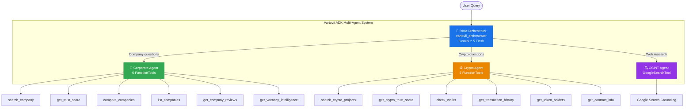

# Vartovii Trust Intelligence Agent

[](https://python.org)
[](https://adk.dev)
[](https://ai.google.dev)
[](LICENSE)
[](https://sentryanalytic.com)

> An autonomous multi-agent trust intelligence system that transforms fragmented public signals into decision-grade assessments — powered by Google ADK and Gemini.

**Track:** Optimize · **Google for Startups AI Agents Challenge 2026**

---

## Why This Exists

Due diligence on crypto projects and employers requires checking dozens of fragmented data sources — CoinGecko, GitHub, Etherscan, Glassdoor, Kununu, Google Reviews. Manual analysis takes hours and misses signals. Single-model AI solutions break under this complexity — they hallucinate numbers, lose context, and can't coordinate specialized tasks.

**Vartovii solves this with a multi-agent architecture** where specialized AI agents collaborate to deliver production-grade trust assessments in seconds.

---

## Agent Architecture



---

## Optimization Journey

This project demonstrates the **Optimize track** — migrating from a monolithic AI pipeline to a production-grade multi-agent system.

| Dimension | Before (Legacy) | After (ADK) |
|-----------|-----------------|-------------|
| **Architecture** | Single Gemini model, manual tool dispatch | 4 `LlmAgent`s with orchestrator delegation |
| **Tools** | 12 Vertex `FunctionDeclaration` objects | 13 ADK `FunctionTool` + `GoogleSearchTool` |
| **Fallback** | ❌ None — 503 = user failure | ✅ 3-tier: primary → fallback → gemini-2.0-flash |
| **Error handling** | ❌ Immediate failure on transient errors | ✅ Retry with backoff (503, 429, UNAVAILABLE) |
| **Sessions** | ❌ Stateless | ✅ Per-conversation persistence via `InMemoryRunner` |
| **Degradation** | ❌ Total failure on ADK issues | ✅ ADK → legacy tools graceful fallback |
| **Prompts** | Hardcoded in code | Environment-overridable (`ADK_*_INSTRUCTION`) |
| **Telemetry** | Basic logging | Structured metrics (latency, SLA, fallbacks) |
| **Tests** | Basic coverage | **800+ tests**, 25+ ADK-specific |
| **Deployment** | Local development | **Production on Cloud Run** since March 2026 |

📄 See [evidence/optimization_metrics.md](evidence/optimization_metrics.md) for the full before/after analysis.

---

## Agent Details

| Agent | Domain | Tools | Model |
|-------|--------|-------|-------|
| **Orchestrator** | Pure delegation — never answers directly | — (delegates only) | Gemini 2.5 Flash |
| **Corporate** | Employer analytics: Trust Score, reviews, comparisons, vacancy intelligence | `search_company`, `get_trust_score`, `list_companies`, `compare_companies`, `get_company_reviews`, `get_vacancy_intelligence` | Gemini 2.5 Flash |
| **Crypto** | Crypto intelligence: Trust Score, tokenomics, on-chain forensics | `search_crypto_projects`, `get_crypto_trust_score`, `check_wallet`, `get_transaction_history`, `get_token_holders`, `get_contract_info` | Gemini 2.5 Flash |
| **OSINT** | Real-time web research for entities not in database | `GoogleSearchTool` (Google Search Grounding) | Gemini 2.5 Flash |

---

## Model Configuration

### Stable Profile (Production)

| Task | Primary | Fallback | Ultimate |
|------|---------|----------|----------|
| Chat | `gemini-2.5-flash` | `gemini-2.5-flash` | `gemini-2.0-flash` |
| Report | `gemini-2.5-pro` | `gemini-2.5-flash` | `gemini-2.0-flash` |
| Agent (ADK) | `gemini-2.5-flash` | `gemini-2.5-flash` | `gemini-2.0-flash` |

### Preview Profile (Opt-in)

| Task | Primary | Fallback | Ultimate |
|------|---------|----------|----------|
| Chat | `gemini-3-flash-preview` | `gemini-2.5-flash` | `gemini-2.0-flash` |
| Report | `gemini-3.1-pro-preview` | `gemini-2.5-flash` | `gemini-2.0-flash` |
| Agent (ADK) | `gemini-3-flash-preview` | `gemini-2.5-flash` | `gemini-2.0-flash` |

All models are environment-overridable. The 3-tier fallback ensures **zero user-visible failures**.

---

## Quick Start

### Prerequisites
- Python 3.11+
- Google API Key ([get one here](https://aistudio.google.com/apikey))

### Setup

```bash
# Clone and setup
git clone https://github.com/Vetassikc/vartovii-trust-agent.git
cd vartovii-trust-agent

# Create virtual environment
python -m venv .venv
source .venv/bin/activate

# Install dependencies
pip install -e ".[dev]"

# Configure
cp .env.example .env
# Edit .env and add your GOOGLE_API_KEY
```

### Run the Agent

```bash
# Option 1: ADK Web Interface (recommended for demo)
adk web agent/

# Option 2: Run demo scenarios
python -m demo.run_demo

# Option 3: Run a specific demo (0-4)
python -m demo.run_demo 0   # Corporate assessment
python -m demo.run_demo 1   # Crypto analysis
python -m demo.run_demo 2   # Company comparison
python -m demo.run_demo 3   # OSINT investigation
python -m demo.run_demo 4   # Blockchain forensics
```

### Run Tests

```bash
pytest tests/ -v
```

---

## Demo Scenarios

### 1. 🏢 Corporate Trust Assessment
```
Query: "Analyze SAP as an employer"
→ Orchestrator delegates to Corporate Agent
→ search_company("SAP") → get_trust_score("SAP")
→ Returns: Trust Score 74/100, MEDIUM risk, breakdown by 6 pillars
```

### 2. 🪙 Crypto Project Analysis
```
Query: "Give me the full trust assessment for Uniswap"
→ Orchestrator delegates to Crypto Agent
→ search_crypto_projects("Uniswap") → get_crypto_trust_score("uniswap")
→ Returns: Trust Score 78/100, security score, dev activity, TVL
```

### 3. 🔗 Blockchain Forensics
```
Query: "Check wallet 0xd8dA6BF26964aF9D7eEd9e03E53415D37aA96045"
→ Orchestrator delegates to Crypto Agent
→ check_wallet("0xd8dA...") → get_transaction_history("0xd8dA...")
→ Returns: 1,247 ETH balance, recent transactions, Etherscan links
```

---

## Project Structure

```
vartovii-trust-agent/
├── agent/                    # Core ADK agent definitions
│   ├── adk_agent.py         # Root orchestrator + 3 sub-agents
│   ├── config.py            # Model routing + fallback chains
│   ├── prompts/
│   │   └── adk.py           # Agent instruction prompts
│   └── tools/
│       ├── corporate_tools.py  # 6 corporate intelligence tools
│       ├── crypto_tools.py     # 6 crypto + forensic tools
│       └── mock_data.py        # Demo data providers
├── services/                 # Service layer (routing, telemetry)
├── tests/
│   └── test_agent.py         # Architecture + tool tests
├── evidence/
│   ├── production_rollout_report.md  # Cloud Run deployment proof
│   └── optimization_metrics.md       # Before/after evidence
├── demo/
│   └── run_demo.py           # Interactive demo runner
├── pyproject.toml
├── .env.example
└── README.md
```

---

## Tech Stack

| Layer | Technology |
|-------|-----------|
| **AI Framework** | Google Agent Development Kit (ADK) 1.27.3 |
| **Models** | Gemini 2.5 Flash, Gemini 2.5 Pro, Gemini 3.x Preview |
| **Language** | Python 3.11+ |
| **Backend** | FastAPI (production) |
| **Database** | PostgreSQL + Neon pgvector (production) |
| **Deployment** | Google Cloud Run, europe-west6 |
| **Search** | Google Search Grounding (OSINT agent) |
| **Testing** | pytest (800+ tests in production) |

---

## Production Context

This submission repo contains a sanitized extraction of the agent layer from the production **Vartovii** platform:

| Metric | Value |
|--------|-------|
| **Live URL** | [sentryanalytic.com](https://sentryanalytic.com) |
| **Crypto projects tracked** | 6,700+ |
| **Companies tracked** | 500+ |
| **Employee reviews analyzed** | 100,000+ |
| **ADK deployment date** | March 25, 2026 |
| **Test suite** | 800+ tests |
| **Uptime** | 99.5%+ |

📄 See [evidence/production_rollout_report.md](evidence/production_rollout_report.md) for deployment verification.

---

## Business Model

Vartovii operates as a **B2B SaaS** trust intelligence platform:
- **Primary market:** Crypto investors, VCs, compliance teams
- **Secondary market:** Job seekers, HR departments
- **Revenue:** Subscription tiers (Free, Pro, Enterprise)
- **Moat:** 6,700+ scored projects, proprietary scoring algorithms, multi-source data fusion

---

## License

[MIT](LICENSE) — Vitalii Radionov, 2026

---

## Links

- 🌐 **Live Platform:** [sentryanalytic.com](https://sentryanalytic.com)
- 📖 **Documentation:** [docs.sentryanalytic.com](https://docs.sentryanalytic.com)
- 🤖 **ADK:** [adk.dev](https://adk.dev)
- 🧠 **Gemini:** [ai.google.dev](https://ai.google.dev)
